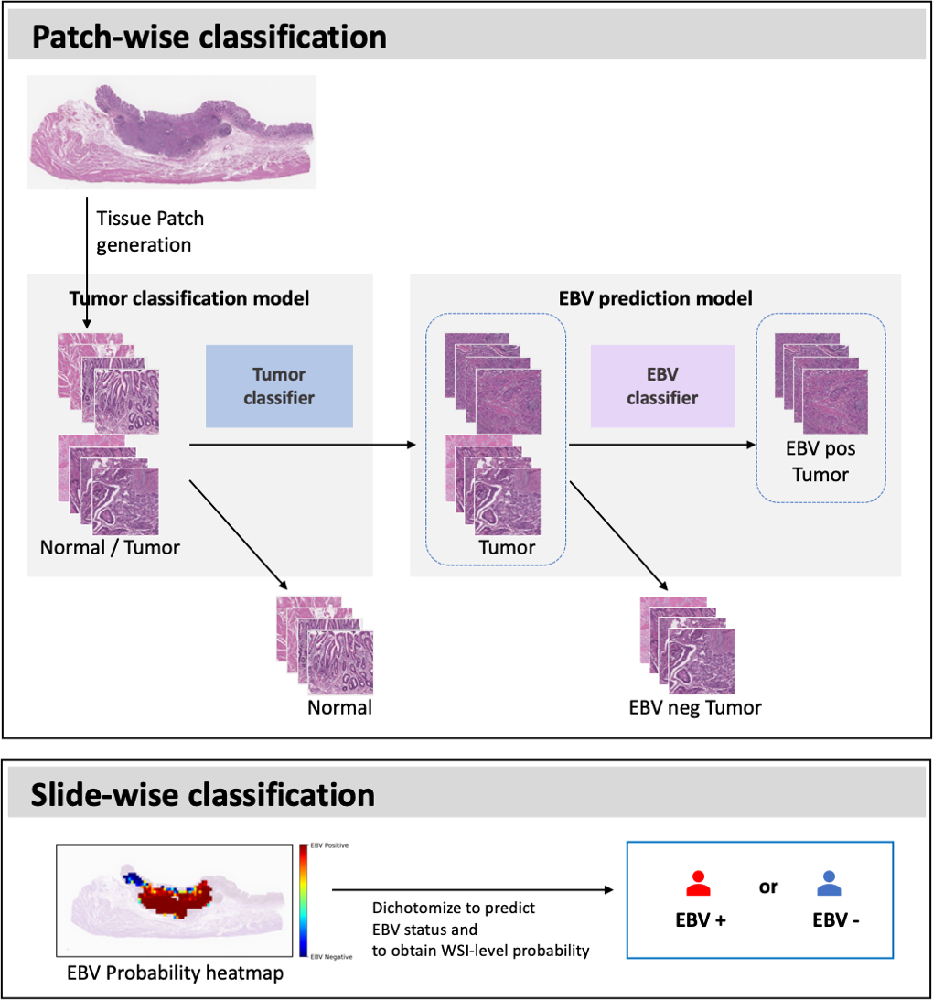

# Deep Learning Model to Predict EBV-Associated Gastric Cancer

## Introduction
This repository contains the description & source code for developing **a deep learning-based model to predict EBV-associated gastric cancer.**

The model was implemented using Keras API. 

## Workflow
- Our deep learning model, EBVNet, aims in detection of Epstein-Barr virus (EBV) from H&E-stained whole slide images (WSIs). 


- **Patch-wise classification**
  - 1. From WSI, we generate tissue patches 
  - 2. Tumor classifier : Normal vs. Tumor
  - 3. EBV classifier : EBV Positive Tumor vs. EBV Negative Tumor 
  
- **Slide-wise classification**
  - 1. Patch-wise classification for all the patches extracted from single patient's WSI. 
  - 2. If **ebv-pos-ratio (# EBV Positive Tumor Patches / # Tumor Patches)** exceeds pre-defined threshold, the WSI is classified as EBV Positive. 

## Tissue Patch Generation
- Tissue patches were generated by sliding window method. 
- To remove non-tissue white background, a threshold-based segmentation method was adopted using the Otsu algorithm after the WSIs were transferred to the HSV color space 
- Only patches with a tissue/background ratio >= 0.7 were selected.
- Patches where the tumor tissue accounts for more than 70% of area were classified as tumor class patches.
- We generated patch size of 1024 x 1024, then resized to 512 x 512 size. 
- _* Note that our models were trained with patches in HSV color space, not the RGB color space._ 

## EBVNet 
- You can get the trained models of EBVNet in this [link](https://drive.google.com/file/d/1hsNfuSXZuNjBhi4pxNkN5nNYgM_qArAQ/view?usp=sharing). Details for the weights are described below. 

### Tumor classifier 
- Tumor classifier was developed based on ResNet50.
- It is binary classifier that classifies Normal vs. Tumor 
- Based on base model (ResNet50), Tumor classifier returns the probability for tumor of input patch. 
  - Additional layers were appended to the base model. 
    - GlobalAveragePooling layer 
    - Dropout layer (p=0.3)
    - Dense layer (dense unit 1664) (with ReLU activation function)
    - Dropout layer (p=0.3)
    - Dense layer (dense unit 1) (with Sigmoid activation function) 
  - Augmentation
    - All the patches for training and validation were augmented by rotation (90, 180, 270 degree) and flipping (vertical & horizontal).  
    - For extra augmentation of patches, we used [Albumentations](https://albumentations.ai/) library.
      ```
      train_transforms = albumentations.Compose([
        albumentations.HorizontalFlip(p=0.5),
        albumentations.VerticalFlip(p=0.5),
        albumentations.ElasticTransform(p=0.5),
        albumentations.HueSaturationValue(p=0.5),
        albumentations.RandomBrightnessContrast(p=0.5),
      ])
      ```
  - Hyperparameters
    - Adam optimizer (initial learning rate 1e-4)
    - Loss : Binary crossentropy 
    - Metrics : Accuracy
    - Callbacks : ReduceLROnPlateau, EarlyStopping

- We provide the weights of trained Tumor classifiers. All the models requires input size of 512 x 512. 
  - 1) `Tumor_classifier.h5` : Tumor classifier (based on ResNet50). It was trained with TCGA slides. 
  - 2) `Tumor_classifier_ft.h5` : Tumor classifier (based on ResNet50). It was trained with TCGA slides and fine-tuned with ISH slides. 

### EBV classifier 
- EBV classifier was developed based on InceptionV3.
- It is binary classifier that classifies EBV Positive Tumor vs. EBV Negative Tumor 
- Based on base model (InceptionV3), EBV classifier returns the probability for EBV-positive tumor of input patch. 
    - Additional layers were appended to the base model. 
      - GlobalAveragePooling layer 
      - Dropout layer (p=0.3)
      - Dense layer (dense unit 1568) (with ReLU activation function)
      - Dropout layer (p=0.3)
      - Dense layer (dense unit 1) (with Sigmoid activation function) 
  - Augmentation
    - Augmentation strategy was same with Tumor classifier. 
  - Hyperparameters
    - Adam optimizer (initial learning rate 1e-3)
    - Loss : Binary crossentropy 
    - Metrics : Accuracy
    - Callbacks : ReduceLROnPlateau, EarlyStopping

- We provide the weights of trained EBV classifiers. All the models requires input size of 512 x 512. 
  - 1) `EBV_classifier.h5` : EBV classifier (based on InceptionV3). It was trained with TCGA slides. 
  - 2) `EBV_classifier_ft.h5` : EBV classifier (based on InceptionV3). It was trained with TCGA slides and fine-tuned with ISH slides. 

## Slide-level Classification 
- `slide_level_classification.py` provides the code to make slide-level inference. 
```
python slide_level_classification.py --patch-result patch_result.csv --tumor-threshold 0.5 --ebv-threshold 0.1 --ebv-pos-ratio-threshold 0.2
```
- `--patch-result` : A csv file that contains **patch-level classification** result
  - This csv file requires 4 columns 
    - 1) `patient_id` : ID of the patient to which the patch belongs. 
    - 2) `is_EBV_pos` : The EBV status of the patient to which the patch belongs. (Boolean)
    - 3) `tumor_prediction` : Output value from the Tumor classifier (Float between 0 and 1)
    - 4) `ebv_prediction` : Output value from the EBV classifier (Float between 0 and 1)
- `--tumor-threshold` : Threshold value for the Tumor classifier 
- `--ebv-threshold` : Threshold value for the EBV classifier
- `--ebv-pos-ratio-threshold` : Threshold value for final slide-level classification (# EBV Positive Tumor Patches / # Tumor Patches) 

- Output : It returns the evaluation metrics (classification report, specificity, NPV, AUROC, AUPRC) 
